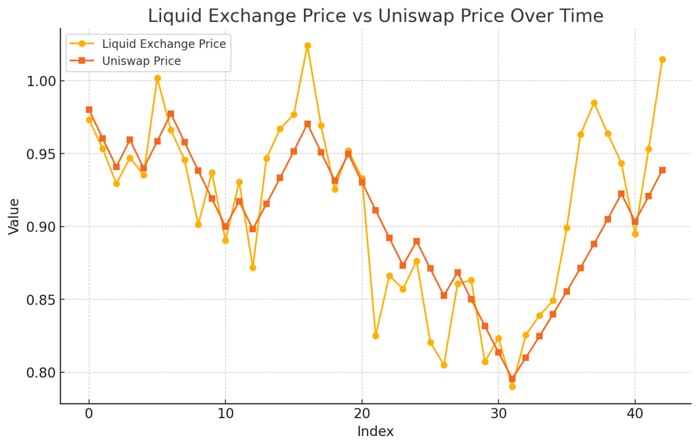

# arena 🏟️


[](https://twitter.com/anthiasxyz)


> *Arena is a powerful and extensible framework for holistic economic modelling and simulation of Uniswap v4 strategies, hooks and pools.*

Track how metrics evolve over time, and over various market conditions.

Arena has an [examples](https://github.com/arena-rs/arena/tree/main/examples) folder on how to use the framework.

## Overview

Arena introduces a novel approach to LP simulation through a highly-configurable event-driven runtime. Each event consists of integral market information for a strategy, from which the actor can derive insight from.

Arena is an [alloy](https://alloy.rs) native project, utilizing many crate-native features such as the `sol!` procedural macro, and the `Anvil` testnet node implementation.

## Key features
- Event-driven simulation runtime.
- Flexible performance analysis and telemetry.
- Multi-strategy support.
- Customizable stochastic process price feeds.
- Customizable arbitrageur and market dynamics. 

## Technical details
Every LP strategy must implement the `Strategy` trait. This contains two key methods:
- `init()` is called upon initialization of the Arena runtime.
- `process()` is called each discrete timestep of the simulation.

These methods allow LP strategies to define specific behaviors and heuristics based on general market updates. Both functions are provided with:
- An `Engine` for liquidity modification
- A provider connected to the Anvil instance
- A `Signal` containing comprehensive market information

Additionally, each LP strategy accepts an `Inspector`. An `Inspector` allows custom behavior to be defined for performance analysis of strategy and continuous telemetry. Arena provides default `Inspector` implementations for CSV output and JSON output. 

The runtime can hold multiple strategies in paralell.

The price of the Uniswap pool being simulated is set via the `Feed` trait. This allows for custom stochastic processes or backtesting feeds to be defined. The price of the pool is pegged to this price feed by utilizing an arbitrageur. 

Arena also provides an infinitely liquid exchange, much like centralized exchanges in real markets, which the price is set on. The arbitrageur then swaps between this and the pool, thus tying the two prices.

The arbitrageur makes swaps every timestep to equalize the price between these two markets. Arena also provides an `Arbitrageur` trait, allowing for custom behaviors to be defined and custom arbitrage strategies. We recommend most users use the `FixedArbitrageur` implementation, which swaps a fixed amount each price equalization. This simulates an inefficient market whilst also tracking the price feed effectively.

Below is a graph showing the price of the liquid exchange with relation to the Uniswap pool, using a `FixedArbitrageur`. The `FixedArbitrageur` accepts a `depth` parameter, which controls how much is swapped on each timestep. The below graph shows a run with a depth of 100000, which we find is a good balance between tracking granularity and minimizing tracking lag.



## Usage

To use Arena, the Rust programming language alongside the Foundry framework must be installed on your machine. This is commonly achieved using [`rustup`](https://rustup.rs/), and [`foundryup`](https://book.getfoundry.sh/getting-started/installation)

Arena can be added to your library or binary with 
```
cargo add arena-core
```

If you wish to build from source, the project can be cloned with:
```
git clone https://github.com/arena-rs/arena.git
cd arena
git submodule update --init --recursive
```

## Next steps

- Explore the documentation for detailed usage instructions.
- Check out example strategies in the `examples/` directory.

We welcome contributions!

See our [Contributing Guidelines](https://github.com/arena-rs/arena/blob/main/CONTRIBUTING.md)
